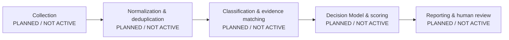

# Case 05 — AI Career Intelligence

**Intelligent Job Opportunity Decision System**

AI Career Intelligence is the proposed broader system for supporting transparent,
evidence-aware career opportunity decisions. **AI Job Radar** is a prospective
module/concept within that system, intended to discover and organize job
opportunities if it is implemented in a later increment.

## Current public status

This public repository is **only a scaffold**. It contains documentation,
package metadata, synthetic example configuration, an empty reference dataset,
and scaffold-level tests. It does not contain an operational decision system.

### IMPLEMENTED

- Case 05 public identity and truthful status documentation
- Python package metadata with no runtime dependencies
- Synthetic example configuration files
- An empty reference-job dataset
- Standard-library scaffold tests
- A standard-library public-release sanitization check for the publication candidate
- A reserved `src/ai_job_radar` package namespace; its presence does not mean an
  AI Job Radar module is operational

### PLANNED / NOT ACTIVE

All operational stages and capabilities are target-state concepts only:

- authorized-source collection
- normalization and identity resolution
- cross-run deduplication
- semantic classification
- deterministic gates and scoring
- Candidate Readiness assessment
- LLM evaluation
- reporting and change detection
- security enforcement and audit controls
- agents or automated actions
- Decision Model runtime

No stage above is implemented or active in this public scaffold.

## Target architecture — PLANNED / NOT ACTIVE

The following diagram is architectural intent, not a description of running
software.

## Public artifacts

- `docs/CASE05_PUBLIC_BLUEPRINT.md` — truthful architectural and publication blueprint
- `docs/SCORING_MODEL_V2.md` — `DRAFT_NOT_ACTIVE` target-state scoring notes
- `config/*.example.json` — synthetic examples, not active configuration
- `data/reference_jobs.json` — empty placeholder dataset

The repository makes no claim that collection, analysis, scoring, evaluation,
reporting, security controls, agents, or a Decision Model runtime exist.
