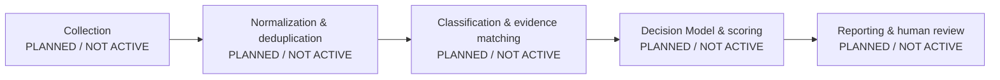

# Case 05 — AI Career Intelligence

**Intelligent Job Opportunity Decision System**

AI Career Intelligence is the proposed broader system for supporting transparent,
evidence-aware career opportunity decisions. **AI Job Radar** is a prospective
module/concept within that system, intended to discover and organize job
opportunities if it is implemented in a later increment.

## Quickstart

This repository requires Python 3.11 or newer and currently exposes a public
scaffold rather than a runnable job-discovery product. From the repository root,
run the scaffold test suite:

```sh
PYTHONPATH=src python3 -m unittest discover -s tests
```

## Current public status

This public repository is **only a scaffold and narrow, non-operational public
foundation**. It contains documentation, package metadata, synthetic example
configuration, an empty reference dataset, scaffold-level tests, and an
in-memory `PublicJobRecord` contract. It does not contain an operational AI Job
Radar or decision system.

### IMPLEMENTED

- Case 05 public identity and truthful status documentation
- Python package metadata with no runtime dependencies
- Synthetic example configuration files
- An empty reference-job dataset
- Standard-library scaffold tests
- A standard-library public-release sanitization check for the publication candidate
- A strict standard-library in-memory `PublicJobRecord` value contract; it does
  not load, transform, normalize, enrich, or process records
- A reserved `src/ai_job_radar` package namespace; its presence does not mean an
  AI Job Radar module is operational

### PLANNED / NOT ACTIVE

All operational stages and capabilities are target-state concepts only:

- authorized-source collection
- loading, transformation, normalization, enrichment, and identity resolution
- cross-run deduplication
- semantic classification and requirement/evidence matching
- deterministic gates, scoring, ranking, and recommendation
- Candidate Readiness assessment
- LLM evaluation
- reporting and change detection
- security enforcement and audit controls
- agents or automated actions
- Decision Model runtime

No stage above is implemented or active in this public scaffold.

## Target architecture — PLANNED / NOT ACTIVE

The following diagram is architectural intent, not a description of running
software.



## Public artifacts

- `docs/CASE05_PUBLIC_BLUEPRINT.md` — truthful architectural and publication blueprint
- `docs/SCORING_MODEL_V2.md` — `DRAFT_NOT_ACTIVE` target-state scoring notes
- `docs/PUBLIC_RELEASE_CHECKLIST.md` — public-release scope, gates, and maintainer checklist
- `config/*.example.json` — synthetic examples, not active configuration
- `data/reference_jobs.json` — empty placeholder dataset
- `src/ai_job_radar/job_record.py` — immutable in-memory public record contract

This repository is available under the [MIT License](LICENSE).

The record contract does not establish an operational AI Job Radar. The
repository makes no claim that collection, loading, transformation,
normalization, enrichment, deduplication, classification,
requirement/evidence matching, Candidate Readiness, scoring, ranking,
recommendation, LLM evaluation, reporting, security controls, agents, or a
Decision Model runtime exist.

## Release verification

Run these checks from the repository root before publishing a candidate:

```sh
PYTHONPATH=src python3 -m unittest discover -s tests
PYTHONPATH=src python3 -m ai_job_radar.public_sanitizer
```

Both commands must pass. The sanitizer inspects tracked files and untracked,
non-ignored files in the current publication candidate; it does not inspect Git
history or replace human review.
